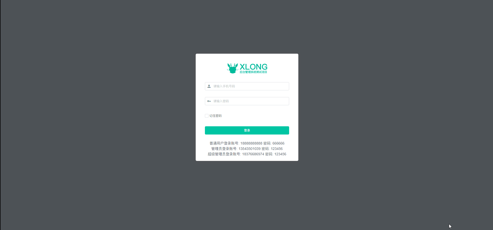
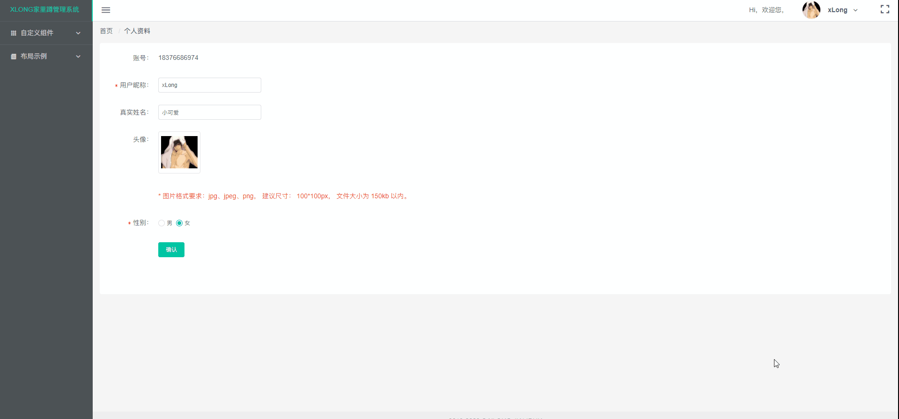
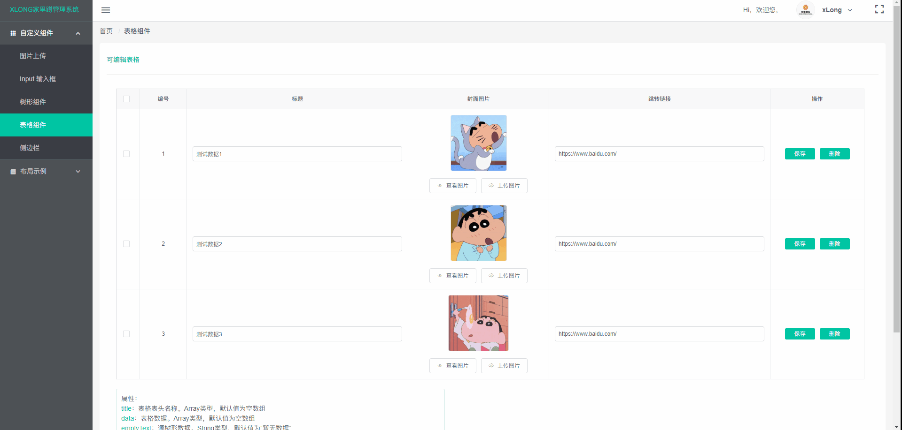
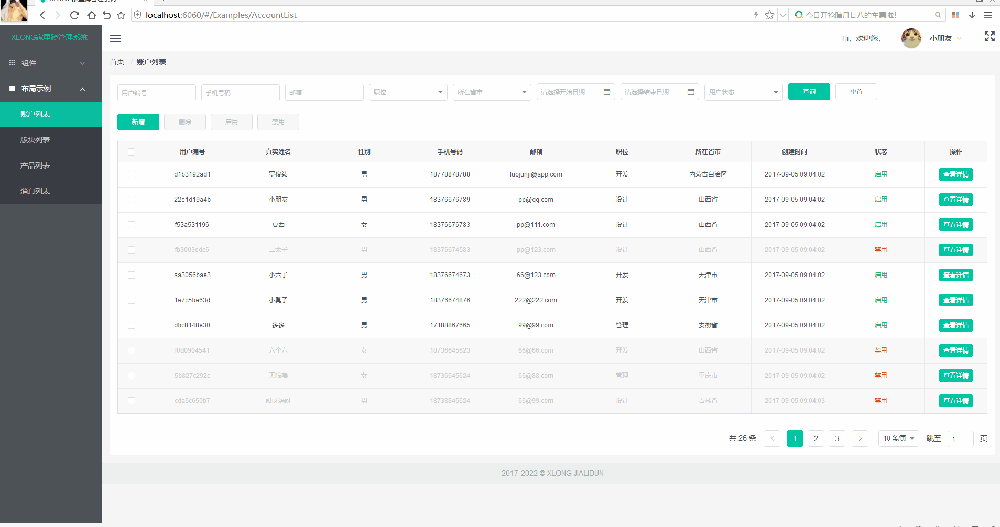
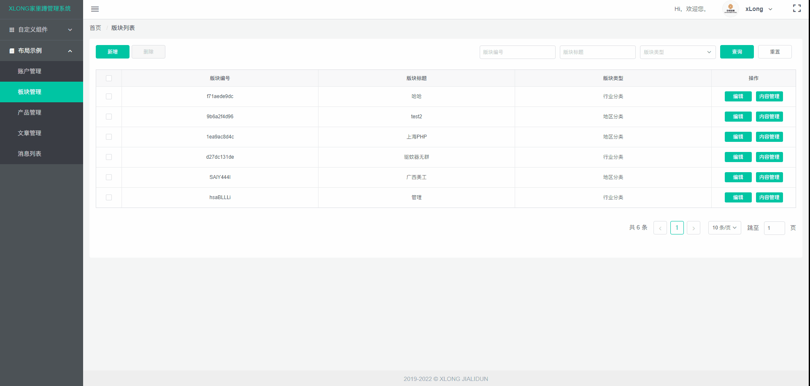

# xlong-admin-vue

## 介绍

xlong-admin-iview 是一套基于 Vue + iView +Bmob 开发的单页面客户端渲染管理后台系统示例。

*仅作学习参考，请勿商用

## 项目展示

> DEMO地址：https://xlong1029.github.io/xlong-admin-vue/#/Login

## 项目迭代

1. V1.0版本

    文件存储使用七牛云（由于测试域名被收回的原因，上传功能保留，但无法获取上传成功后的URL）；<br/>
    富文本编辑器使用 Vue-quill-editor

2. V2.0版本

    富文本编辑器改用Tinymce；<br/>
    图片裁剪组件，裁剪后改用实时预览方式；<br/>
    Bmob改用依赖包引入方式；<br/>
    文件存储使用Bmob存储，已解决跨域问题

3. V3.0版本

    更新iView至3.x版本，并通过vue-cli3.0重构项目；<br/>
    移除:jQuery插件，侧边栏组件改用原生JS方法重写；<br/>
    Bmob已添加自定义域名，解决上传文件提示"invisible domain"的问题；<br/>
    添加:404页面、路由访问权限和“可编辑表格”和“树形筛选”组件<br/>

## 项目说明

#### 1. 前后端分离开发模式
- **前端**：Vue + Webpack+ iView
- **后端**：Bmob

#### 2. 项目用到技术、框架与插件
[Vue.js](https://github.com/vuejs)<br/>
[webpack](https://github.com/webpack)<br/>
[iView](https://github.com/iview/iview)<br/>
[Tinymce](https://github.com/tinymce/tinymce)<br/>
[vue-awesome-swiper](https://github.com/surmon-china/vue-awesome-swiper)<br/>

## 部分项目运行截图
* 登录界面



* 个人资料



* 树形筛选


* 可编辑表格



* 图片上传



* 账户管理功能


* 版块管理功能



## 目录结构

```
│  .babelrc
│  .browserslistrc // 浏览器可访问配置
│  .editorconfig
│  .postcssrc.js
│  .gitignore
│  jest.config
│  package.json
│  babel.config.js // babel配置
│  postcss.config.js // CSS转换配置
│  vue.config.js // 配置文件
│  README.md
│
├─pubilc
│   favicon.ico // 图标
│   index.html // 首页入口文件
│
├─src
│  │  main.js // 项目入口js
│  │  app.js // 根组件
│  │
│  ├─assets // 资源目录，这里的资源会被wabpack构建
│  ├─api // api接口文件
│  ├─theme // iView主题样式
│  ├─store  // 应用级数据（state）
│  │
│  ├─mock // 测试数据
│  │    city.json // 省市数据
│  │    data.json // 部分模拟数据
│  │
│  ├─components // 功能组件
│  │  │
│  │  ├─Common // 通用组件
│  │  ├─Image // 图片相关组件
│  │  ├─Input // 信息输入相关组件
│  │  ├─Sidebar // 侧边栏相关组件
│  │  ├─Tree // 树形相关组件
│  │  └─Table // 表格相关组件
│  │
│  ├─views // 视图
│  │  │
│  │  ├─Layout // 布局视图
│  │  ├─Home // 主页
│  │  ├─Components // 组件展示相关
│  │  ├─Error // 错误页面
│  │  ├─Examples // 操作示例相关
│  │  ├─Passport // 通行验证，登录注册等
│  │  └─Profile // 个人信息相关
│  │
│  ├─mixins // 混合模块
│  │    city_select.js // 城市联级选择
│  │    email_complete.js // 文章管理
│  │    page.js // 页码配置
│  │    table_operate.js // 表格操作
│  │    table_query.js // 表格查询
│  │    upload_img.js // 上传图片
│  │
│  ├─common // 通用js模块
│  │    common.js // 封装一些公共常量
│  │    table_setting.js // 封装一些iView表格按钮渲染
│  │    validate.js // 封装一些iView表单验证方法
│  │
│  ├─utils // 通用工具函数
│  │    index.js
│  │
│  ├─bmob  // 封装Bmob请求函数
│  │    bmob-server.js
│  │
│  └─router  // 路由配置
│       index.js
│       routes.js
│
├─static // 静态资源
│
└─tests // 单元测试文件
```

## 本地运行
1. 安装前台依赖
> npm install
2. 运行前台项目
> npm run serve
3. 访问地址：http://localhost:6060

## 项目打包
> npm run build

## 作者联系方式

QQ：381612175
TEL: 18376686974

github：https://github.com/xLong1029/

站酷主页：http://xlong.zcool.com.cn/

UI中国：http://i.ui.cn/ucenter/358591.html

* 此项目做学习Vuejs测试使用，有什么问题可联系我讨论
